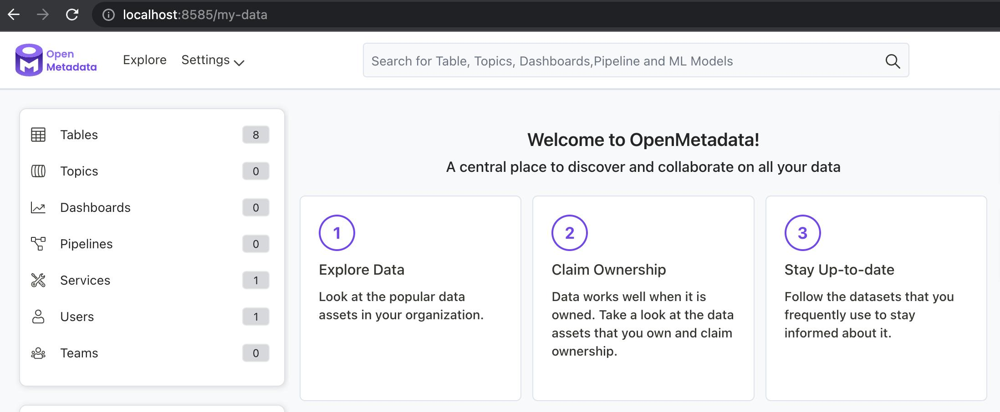

# Install OpenMetadata

## Requirements

Please ensure your host system meets the requirements listed below:

- Python 3.8+
- Docker 20.10.0+
- Docker Compose

## Installing OpenMetadata

### Clone the ``prefect-openmetadata`` repository

First, clone the latest version of the [prefect-openmetadata](https://github.com/PrefectHQ/prefect-openmetadata) Prefect Collection. 

Then, navigate to the directory ``openmetadata-docker`` containing the `docker-compose.yml` file with the minimal requirements to get started with OpenMetadata.


### Start OpenMetadata containers
You can start the containers with OpenMetadata components using:

```yaml
docker compose up -d
```

This will create a docker **network** and **containers** with the following services:

- `openmetadata_mysql` - metadata store that serves as a persistence layer holding your metadata,
- `openmetadata_elasticsearch` - indexing service to search the metadata catalog,
- `openmetadata_server` - the OpenMetadata UI and API server allowing you to discover insights and interact with your metadata.

Wait a couple of minutes until the setup is finished.

To check the status of all services, you may run the `docker compose ps` command to investigate the status of all Docker containers:

```yaml
NAME                         COMMAND                  SERVICE               STATUS              PORTS
openmetadata_elasticsearch   "/tini -- /usr/local…"   elasticsearch         running             0.0.0.0:9200->9200/tcp, 0.0.0.0:9300->9300/tcp
openmetadata_mysql           "/entrypoint.sh mysq…"   mysql                 running (healthy)   33060-33061/tcp
openmetadata_server          "./openmetadata-star…"   openmetadata-server   running             0.0.0.0:8585->8585/tcp
```

### Confirm you can access the OpenMetadata UI

Visit the following URL to confirm you can access the UI and start exploring OpenMetadata:

```yaml
http://localhost:8585
```

Login with username `admin` and password `admin`. 

You should see a page similar to the following as the landing page for the OpenMetadata UI.




### Why should you use Prefect for metadata ingestion?

The challenge with the metadata ingestion is to ensure that this process can be **automated** and can run **reliably**, either on a regular interval, or ad-hoc. This is where [Prefect](http://prefect.io/) can help.

[Prefect](https://www.prefect.io/guide/blog/the-global-coordination-plane/) is a general-purpose orchestration and dataflow coordination platform allowing you to build, run, schedule, and operationalize your dataflow at scale. It supports both [batch and streaming workflows](https://discourse.prefect.io/t/how-to-use-prefect-2-0-for-streaming-and-event-driven-use-cases/1000) and provides an excellent developer experience allowing you to run your flows locally and seamlessly move to production and to Cloud when you’re ready.


Among [many other features](https://www.prefect.io/opensource/v2/), it natively supports:

- dynamic runtime-discoverable and modular workflows,
- passing data between tasks,
- running your workflows on various execution platforms (on-prem, cloud, Docker, Kubernetes, serverless containers, and more) while maintaining privacy via a [hybrid execution model](https://www.prefect.io/why-prefect/hybrid-model/),
- scaling out for parallel and concurrent execution with [async, Dask, and Ray](https://docs.prefect.io/concepts/task-runners/),
- various integrations through [Prefect Collections](https://docs.prefect.io/collections/overview/) - such as this one!

### Install Prefect 

You can **install** Prefect and other dependencies needed for this integration using the command (run this from the home directory which `prefect-openmetadata` was cloned into):

```yaml
pip install -r requirements.txt
```

To make sure that OpenMetadata logs are stored in the Prefect backend and displayed in the UI, run the following command:
```shell
prefect config set PREFECT_LOGGING_EXTRA_LOGGERS='Ingestion,OMetaAPI,Metadata,Profiler,Utils'
```

This way, Prefect is aware of the [extra loggers from OpenMetadata](https://discourse.prefect.io/t/how-to-add-extra-loggers-to-prefect-2-0/1040).


### Self-hosted Orion server

When you install Prefect, this will not only install the client library, but also an ephemeral API server and UI, which can be *optionally* started using:

```yaml
prefect orion start
```

If you navigate to the URL, you’ll be able to access a locally running Prefect Orion UI:

```yaml
http://localhost:4200
```


### Prefect Cloud

Alternatively, you can sign up for a free [Prefect Cloud](https://app.prefect.cloud/) account and [create a workspace](https://docs.prefect.io/ui/cloud-getting-started/#create-a-workspace).  Then, install Prefect and log into your Cloud workspace from a terminal:

```bash
pip install prefect
prefect cloud login
```

